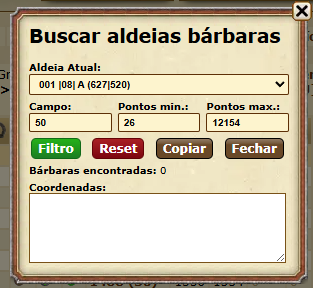

# 🏹 Buscar Bárbaras - Tribal Wars

Script para jogadores do **Tribal Wars** que desejam encontrar rapidamente **aldeias bárbaras** dentro de um determinado raio, filtrando por **pontos mínimos e máximos**, e com base na aldeia atual.

---

## 🔧 Funcionalidades

- 🔍 Filtro por distância em **campos** (raio)
- 🔢 Definição de **pontos mínimos e máximos**
- 🧭 Escolha da **aldeia base** de origem (com seleção automática das suas aldeias)
- 🗺️ Exibe **quantidade de bárbaras** encontradas
- 📋 Botão para copiar as **coordenadas**
- 🧼 Botão para resetar filtros
- 🎯 Interface compacta com **visual estilo Tribal Wars**

---

## 🖥️ Como Usar

1. Acesse qualquer página dentro do jogo (preferencialmente uma que carregue `game_data`)
2. Cole o conteúdo do script no **console do navegador** (F12 → Console)
   ```javascript
   // Cole o conteúdo de buscarBarbaras.js aqui
   ```

3. Um painel será exibido com as opções de busca:
   - **Aldeia Atual**: selecione a aldeia de origem
   - **Campo**: distância máxima (em campos)
   - **Pontos mín/máx**: limite de pontos das aldeias bárbaras
   - **Botões**:
     - `Filtro`: inicia a busca
     - `Reset`: limpa os dados
     - `Copiar`: copia as coordenadas para a área de transferência
     - `Fechar`: fecha o painel

---

## 🧪 Exemplo de Uso

- Campo: `50`
- Pontos mínimos: `26`
- Pontos máximos: `12154`

🔎 Resultado: o script encontrará todas as **aldeias bárbaras** a até 50 campos da aldeia selecionada, com pontuação entre os valores informados.

---

## 💾 Armazenamento

Este script **não usa localStorage**. Todas as configurações são resetadas ao recarregar a página ou usar o botão "Reset".

---

## ⚠️ Requisitos

- O mapa (`/map/village.txt`) deve estar disponível
- O script deve ser executado **dentro do jogo** (onde `game_data` e `Dialog` estejam definidos)

---

## 📸 Imagem (opcional)



---

## 📄 Licença

[MIT License](LICENSE)

---

💡 Ideal para fazendeiros e exploradores que querem otimizar sua coleta de bárbaras com base geográfica!
